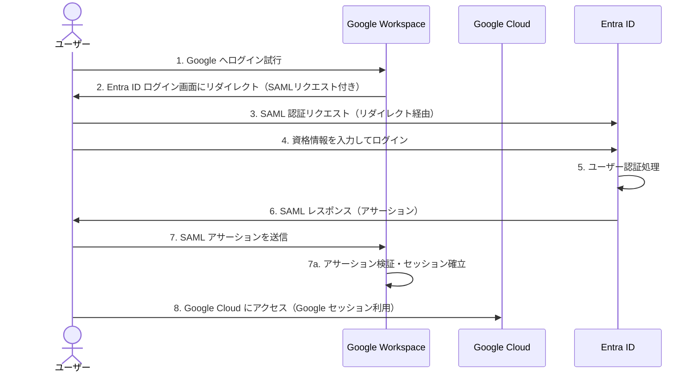

# Google WorkspaceとEntra をSAML連携して SSO する

最近こういう要件が出てきたので、実際に自分でやってみます。

## 要件整理

- Entra ID を IdP として、Google Workspace 及び GoogleCloud の管理コンソールに SSO(SAML) できること
- 専用のドメインを使用した組織管理ができること

## 想定構成

## Entra ID でのカスタムドメイン設定

Azure App Service に既に取得しているドメイン(takidemdev.net)を使用します。
設定方法は[こちらのドキュメント](https://learn.microsoft.com/ja-jp/entra/identity/users/domains-manage)を参照ください。
正常に設定が完了すると、 Entra ID のカスタムドメインブレードに設定したカスタムドメインが表示されます。

## Entra ID SSO 用ユーザーの作成

SSO できることを確認するために使う検証用のユーザーを前項で設定したカスタムドメインのディレクトリに作成します。
私の環境だと、Entra ID のライセンスが無料版なので、 SAML 認証時に Entra ID ユーザーグループを指定することができません。
したがって、今回はユーザーを指定する形にしますので、ユーザーだけ作成します。
ライセンス的に可能であれば、ユーザーグループを SAML 認証に設定するほうが運用負荷が少ないです。

作成するユーザー：gcloud-sso-user@takidemdev.net

## Google Workspace の独自ドメインでの初期設定

Google Workspace Identity Free 版を使用して、組織を新しく作成します。
有償版ではなく、自身の所有するドメインを使用して新しく組織を作る形です。
ここで手順は細かく説明しませんが、以下のドキュメントを参照すればできると思います。
ドメイン検証のために、自身の所有している DNS ゾーンに TXT レコードや CNAME レコードを登録する必要があります。

[組織の Google Workspace を設定する](https://knowledge.workspace.google.com/admin/getting-started/set-up-google-workspace-for-your-organization?hl=ja)

ちゃんと独自ドメインでの Google Workspace の設定ができると Admin 画面上でこのように表示されます。

さらに同期先の子部門として、`microsoft` を親組織(takidemdev)の配下に作成しておきます。
このディレクトリと Entra ID 側の `takidemdev.net` ディレクトリかつエンタープライズアプリケーションに紐付けされたユーザー情報が同期されるという認識で大丈夫です。
同期については特殊な仕様等もあるので、適宜ドキュメントを確認するといいでしょう。

ここまで設定すると以下のような構成になっています。

## Entra ID エンタープライズアプリケーション(Google Workspace)の登録

Google から Entra ID の世界にアクセスするために Google が提供しているエンタープライズアプリケーションを自身の Entra ID 上にデプロイする必要があります。
Entra ID の「アプリの登録」や「エンタープライズアプリケーション」は奥が深く、しっかり理解して設定しないと非常に危険です。
特に今回のようなサードパーティーが用意したエンタープライズアプリケーション(アプリの登録が外部のテナントにある場合)を使う場合は、本当にそのエンタープライズアプリケーションが信頼できるものかを見極める必要があります。

[Entra ID]>[Enterprise Applications]>[New Application]を押下します。

検索窓で `google` と検索して、`Google Cloud / G Suite Connector by Microsoft` というエンタープライズアプリケーションを選択します。

適当な名前をつけて[create]を押下します。

正常に作成されるとエンタープライズアプリケーションの一覧に以下のように表示されます。

## エンタープライズアプリケーションのプロビジョニング

前項で作成したエンタープライズアプリケーションをプロビジョニングして、Google Workspace の API に接続できるようにします。
エンタープライズアプリケーションの[Provisioning]ブレードを押下します。

さらにプロビジョニングの詳細画面に遷移するので、[Provisioning]から `Automatic`モードで[Authorize]を押下します。

よく見る Google アカウントのログイン画面に遷移するので、 Google Workspace 側の特権管理者権限でログインします。

この設定によって、エンタープライズアプリケーションが Google Workspace に特権管理者権限でユーザーをプロビジョニングすることが可能になりました。

## エンタープライズアプリケーションへのユーザー登録

このエンタープライズアプリケーションによって、SSO する対象のユーザーをエンタープライズアプリケーションのプロビジョニング設定に追加する必要があります。
プロビジョニングの設定画面から[Users and groups]ブレードを押下します。
[Add user/group]を押下して、対象のユーザーを追加します。
※前述の通りですが、管理性向上のために直接ユーザーを追加するのは推奨しません。なるべくユーザーグループを指定するようにしましょう。私は無料版なので無理ですが・・・

正常に追加されると以下のようにユーザー一覧が表示されます。ここでは既に作成済みの `ssouser` を追加しています。

## ユーザー属性情報のチューニング

Entra ID のユーザー情報を Google Workspace 側へ連携する際に設定項目ごとにチューニングが必要な場合があります。
まぁ別のサービスなので当然といえば当然ですね。
Google Workspace 側では `surname` と `givenName` が必須になっているようで、これが設定されていないとプロビジョニング時にエラーになります。
では、設定していきます。エンタープライズアプリケーションのプロビジョニング画面から[Attribute mapping]>[Provision Microsoft Entra ID Users]を押下します。

`surname` の[Edit]から[Default value if null (optional)]の値を `_` (アンダースコア)にします。

`givenName` も同じように設定をします。

３つめに Entra ID からプロビジョニングしたユーザーが Google Workspace 側の所属する組織(今回は `microsoft` )を指定する属性情報を追加します。
属性情報一覧からの最下部の[Add New Mapping]から以下のように設定します。

最後にグループマッピングを無効化します。今回は使用しません。

## プロビジョニングの実行

ここまででユーザーをプロビジョニングするための準備が整ったので、実際にプロビジョニングをしてみます。
エンタープライズアプリケーションのプロビジョニング画面から[Provisioning Status]を[On]に変更して[Save]を押下します。
少し時間がかかりますが、プロビジョニングが完了すると Overview の画面で以下のように表示されます。

## Google Workspace 側のユーザー情報の確認

前項でプロビジョニングが完了しましたので、Google Workspace の組織内のユーザーを確認してみます。
今回は `microsoft` という子組織に同期する形にしましたので、以下のようになっています。

ここまで設定すると以下のような構成になっています。

## Google Workspace の SAML Profile の作成

Google Workspace の Admin 画面より、[セキュリティ]>[認証]>[サードパーティの IdP による SSO]に遷移します。
画面右上の[SAML プロファイルを追加]を押下します。※当方既に作成済みなので画面に出ちゃってます

SSO プロファイル名を適当に設定し、あとはデフォルトで下の[保存]を押下します。

作成が完了すると、以下のように IdP 側に設定する設定値や証明書ファイルが表示されるようになります。
これらの情報をもって、Entra ID側での設定をしていきます。
以下の値を使用するので、どこかに控えておいてください。

- エンティティID
- ACS の URL

## Entra ID 側の SAML 設定

続いて、Entra ID のエンタープライズアプリケーションの SAML 設定をしていきます。
SAML の設定は以下のような流れになります。

1. SAML 基本設定
2. 属性、クレーム設定
3. SAML 証明書設定
4. Google Workspace 側の設定

### SAML 基本設定

エンタープライズアプリケーションの Overview 画面から[Set up single sign on]を押下します。

[Basic SAML Configuratio]の[Edit]より、Google Workspace 側のエンティティ情報を設定していきます。

| 設定項目 | 設定値 |
| -------------- | --------------- |
| Identifier (Entity ID) | <エンティティID> |
| Reply URL (Assertion Consumer Service URL) | <ACS の URL> |
| Sign on URL | https://www.google.com/a/takidemdev.net/ServiceLogin?continue=https://console.cloud.google.com/ |

### 属性、クレーム設定

今回は UPN 以外に追加クレームは要らないので、追加クレームはすべて削除します。

必須のクレームについては、今回ドメインは Entra ID と Google Workspace で同じなのでそのままとします。

### SAML 証明書設定

Google workspace 側に設定する SAML 証明書を Base64 でダウンロードします。

また、Google Workspace 側の設定する際に必要になる以下の URL を控えておきます。

- Login URL
- Microsoft Entra Identifier
- Logout URL

### Google workspace 側の設定

Google workspace の SAML プロファイル(Entra ID)の画面に戻り、 IdP の詳細編集画面に遷移します。
前項で控えて置いた値を各設定項目に設定します。

| 設定項目 | 設定値 |
| -------------- | --------------- |
| IdP エンティティID | <Microsoft Entra Identifier> |
| ログインページURL | <Login URL> |
| ログアウトページの URL | <Logout URL> |
| パスワード変更用 URL | https://account.activedirectory.windowsazure.com/changepassword.aspx |

確認用の証明書には base64 でダウンロードした証明書ファイルをアップロードします。

## SAML プロファイルの割り当て

Google Workspace の Admin 画面より、[セキュリティ]>[認証]>[サードパーティの IdP による SSO]に遷移します。
[SSO プロファイルの割り当ての管理]より、[管理]を押下します。
割り当て先の組織(今回は子組織 `microsoft` )を選択し、前項までで設定した SAML プロファイルを割り当てます。

これで SAML による SSO の設定は完了しました。

ここまで設定すると以下のような構成になっています。

## 動作確認

試しに `gcloud-sso-user@takidemdev.net` で Google Drive にアクセスしてみます。

Microsoft のログイン画面にリダイレクトされました。

はい、ちゃんとログインしてホーム画面に入れました。大丈夫そうです。

## Google Cloud にユーザーを招待し、RBAC を設定する。

続いて、Google Cloud 側の設定をしていきます。
ユーザーはエンタープライズアプリケーションのプロビジョニングで同期済みの `ssouser` を使用します。
Google Cloud の [IAM]に遷移し、[アクセスを許可]より、 `ssouser` に対して以下のようにロールを設定してみます。

## 動作確認

Google Cloud に SSO 用ユーザーでログインし、リソースを閲覧、編集できるかを確認します。
ログインはできました！

ログインはできたので、とりあえず default の VPC を削除してみます。

大丈夫そうです。
これにて Entra ID <=> Google Cloud SAML SSO 設定は完了です。

