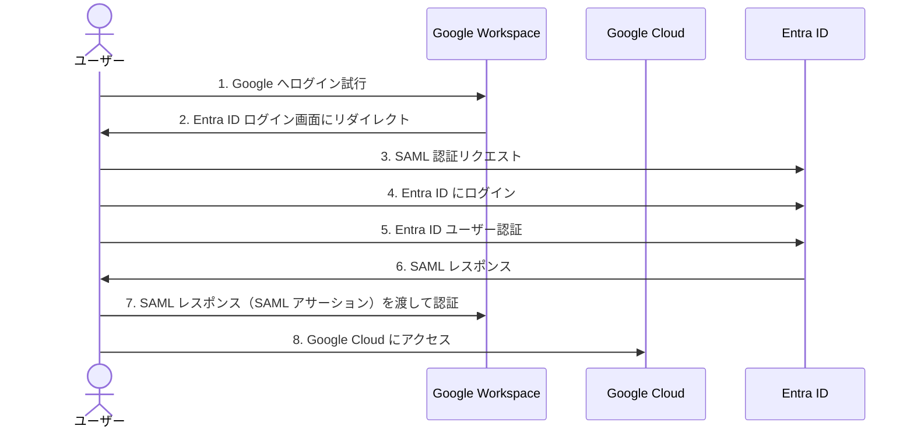

# Google WorkspaceとEntra をSAML連携して SSO する

## 要件整理

- Entra ID を IdP として、Google Workspace 及び GoogleCloud の管理コンソールに SSO(SAML) できること
- 専用のドメインを使用した組織管理ができること

## 想定構成

## 使用するカスタムドメインについて

Azure App Service に既に取得しているドメイン(takidemdev.net)を使用します。
なお、Entra ID にはカスタムドメインとして設定します。

## Google Workspace の独自ドメインでの初期設定

Google Workspace Identity Free 版を使用して、組織を新しく作成する。
有償版ではなく、自身の所有するドメインを使用して新しく組織を作る形です。
ここで手順は細かく説明しませんが、以下のドキュメントを参照すればできると思います。
ドメイン検証のために、自身の所有している DNS ゾーンに TXT レコードや CNAME レコードを登録する必要があります。

[組織の Google Workspace を設定する](https://knowledge.workspace.google.com/admin/getting-started/set-up-google-workspace-for-your-organization?hl=ja)

ちゃんと独自ドメインでの Google Workspace の設定ができると Admin 画面上でこのように表示されます。

さらに同期先の子部門として、`microsoft` を親組織(takidemdev)の配下に作成しておきます。
このディレクトリと Entra ID 側の `takidemdev.net` ディレクトリのユーザーが同期されるという認識で大丈夫です。
同期については特殊な仕様等もあるので、適宜ドキュメントを確認するといいでしょう。

## 
